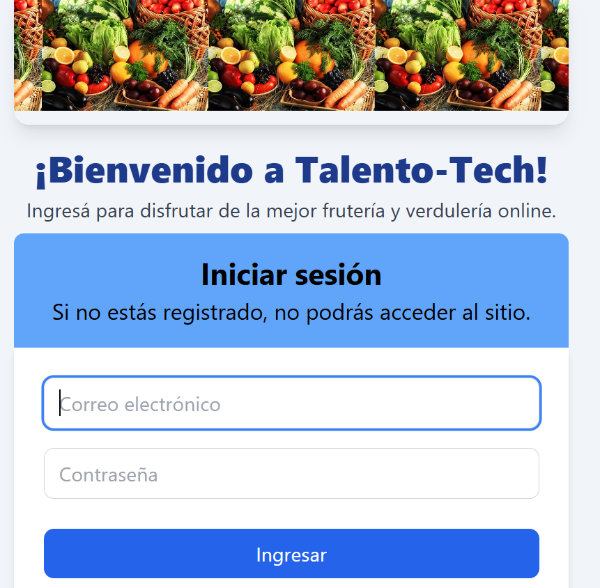
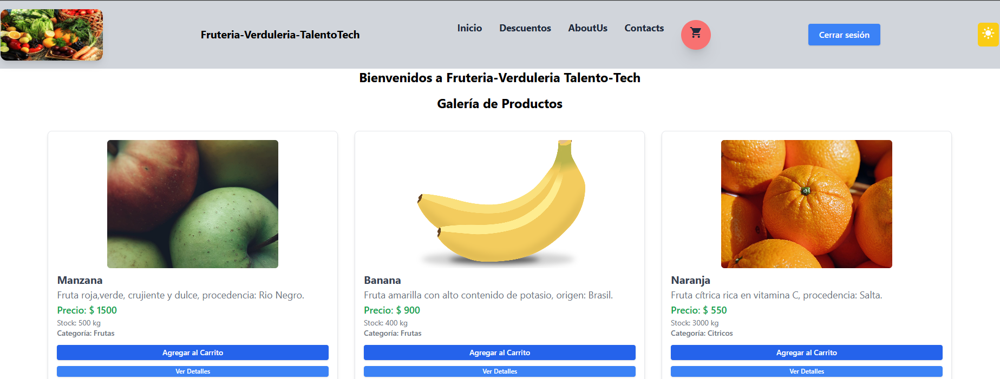
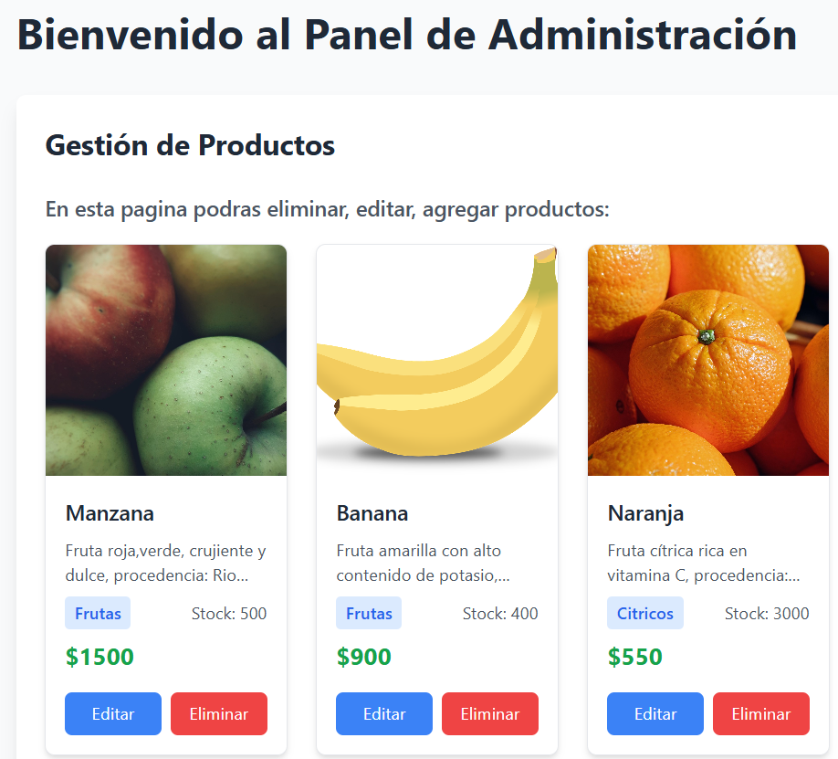

# React + Vite

Ecommerce Frutas y Verduras
Proyecto realizado para el curso Talento Tech - React con Vite.
Este repositorio contiene un ecommerce simple para la venta de frutas y verduras.

🚀 Tecnologías utilizadas

- React
- Context API
- Vite
- JavaScript
- CSS
- HTML
- Tailwind CSS
- date-fns
- Toastify
- SweetAlert2
- Lucide React (íconos)
- MockAPI (para persistencia de datos)
- Framer Motion (animaciones)
- React Router DOM
- Netfily
  -GitHub

🛒 Descripción
Aplicación web de ecommerce que permite a los usuarios navegar, seleccionar y comprar frutas y verduras frescas. Incluye funcionalidades básicas de carrito de compras y gestión de productos.

 **Características principales:**

- Permite dividir el tipo de persona que accede en dos categorías: usuario y administrador
- **Usuario**: puede realizar compras, accediendo al panel de ofertas de acuerdo a la zona de residencia y el día de la semana
- **Administrador**: permite agregar productos, editarlos y borrarlos
- **Sistema de valoración**: Los usuarios pueden valorar su experiencia con íconos interactivos (Disconforme, Conforme, Muy Satisfecho) que se guardan en MockAPI
- **Responsive Design**: Adaptado para móviles, tablets y desktop
- La aplicación se puede acceder en modo desarrollo desde localhost o en producción desde GitHub Pages

**APIs utilizadas:**

- MockAPI para productos: [https://6814d2a7225ff1af162a3ac3.mockapi.io/ecommerce](https://6814d2a7225ff1af162a3ac3.mockapi.io/ecommerce)
- MockAPI para usuarios: [https://683f3f8b1cd60dca33dec719.mockapi.io/users](https://683f3f8b1cd60dca33dec719.mockapi.io/users)
- MockAPI para likes: [https://686be2ca14219674dcc67d83.mockapi.io/likes](https://686be2ca14219674dcc67d83.mockapi.io/likes)

⚙️ Instalación
Clonar el repositorio:
```bash
git clone https://github.com/ignaciolopezbarg/tt-preentrega.git
```
Ingresar a la carpeta del proyecto:
```bash
cd tt-preentrega
```
Instalar las dependencias:
```bash
npm install
```
Iniciar la aplicación:
```bash
npm run dev
💻 Uso

1. Acceder a la aplicación en el navegador en http://localhost:5173 (o el puerto que indique Vite)
2. También puedes acceder en producción: https://tt-react.netlify.app/
3. Navegar por el catálogo de productos
4. Agregar productos al carrito y finaliza la compra
5. Si eres admin, podrás agregar, editar y eliminar productos
6. **Likes**: Al finalizar una compra, se puede valorar tu experiencia con los íconos de satisfacción

**Acceso al sistema:**
El acceso es siempre con Login. Si no estás registrado, te deriva al Registro, quedando todo almacenado en MockAPI.

  <p align = "center" >
 
 
 
  </p>

**Usuarios de prueba:**

- **Usuario regular**:
  - Email: mar@sic.com
  - Password: pass123

- **Administrador**:
  - Email: rio@gma.com
  - Password: pass123

  ** En modo de desarrollo o en produccion, se puede ingresar el mail que se desee, el password, se deriva al registro, se elige la categoria de usuario, y luego se accede a los distintos paneles. El registro queda almacenado en mockapi/ users.**

## 🔗 Rutas disponibles

**Desarrollo (localhost:5173):**

- Producto por ID: `http://localhost:5173/products/:id`
- Producto por nombre: `http://localhost:5173/products/product/:nombre`
- Productos por categoría: `http://localhost:5173/products/category/:categoria`
  - Categorías disponibles: `frutas`, `verduras`, `citricos`

**Producción (Netlify):**

- Producto por ID: `https://tt-react.netlify.app/products/:id`
- Producto por nombre: `https://tt-react.netlify.app/products/product/:nombre`
- Productos por categoría: `https://tt-react.netlify.app/products/category/:categoria`
  - Categorías disponibles: `frutas`, `verduras`, `citricos`

## 📁 Estructura del Proyecto

```
t-preentrega/
├── dist/
├── node_modules/
├── public/
│   └── _redirects
├── data/
│   └── products.json
├── images/
├── src/
│   ├── App.css
│   ├── App.jsx
│   ├── context/
│   │   ├── AuthContext.jsx
│   │   ├── CartContext.jsx
│   │   └── ThemeContext.jsx
│   ├── components/
│   │   ├── Cart.jsx
│   │   ├── ContadorLikes.jsx
│   │   ├── Footer.jsx
│   │   ├── FormularioProducto.jsx
│   │   ├── Header.jsx
│   │   ├── LogoutButton.jsx
│   │   ├── Modo.jsx
│   │   ├── PrivateRoute.jsx
│   │   └── ProductList.jsx
│   ├── pages/
│   │   ├── AboutUs.jsx
│   │   ├── AdminPanel.jsx
│   │   ├── Auth/
│   │   │   ├── Login.jsx
│   │   │   └── Register.jsx
│   │   ├── Checkout.jsx
│   │   ├── Faq.jsx
│   │   ├── FechaDescuento.jsx
│   │   ├── Home.jsx
│   │   ├── NotFound.jsx
│   │   └── ProductDetail.jsx
│   ├── styles/
│   │   └── cart.css
│   ├── index.css
│   ├── index.html
│   ├── main.jsx
│   └── vite.config.js
├── package.json
├── package-lock.json
├── postcss.config.js
├── tailwind.config.js
└── README.md
```


👤 Autor
Ignacio Lopez Barg
📝 Licencia
Este proyecto está bajo la licencia MIT.
